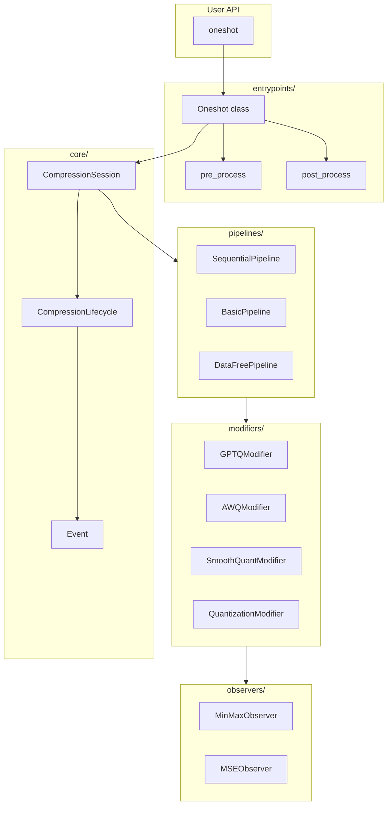

# Directory Guide: src/llmcompressor/

这个文档详细解释 `llm-compressor/src/llmcompressor/` 目录的源码结构。

---

## 目录概览

```
src/llmcompressor/
├── __init__.py             # 包入口，导出公共 API
├── typing.py               # 类型定义
├── sentinel.py             # Sentinel 值工具
├── logger.py               # 日志配置
│
├── args/                   # 参数解析
├── core/                   # 核心引擎
├── datasets/               # 数据集工具
├── entrypoints/            # 入口点 (oneshot)
├── metrics/                # 指标收集
├── modeling/               # 特定模型支持
├── modifiers/              # 量化/稀疏化算法
├── observers/              # 统计观测器
├── pipelines/              # 校准流水线
├── pytorch/                # PyTorch 工具
├── recipe/                 # Recipe 解析
├── transformers/           # Transformers 集成
└── utils/                  # 通用工具
```

---

## 详细说明

### 1. 根目录文件

#### `__init__.py`
**用途**: 包入口，导出公共 API

```python
# 主要导出
from llmcompressor import oneshot  # 主入口函数
from llmcompressor.core import active_session  # 获取当前会话
```

#### `typing.py`
**用途**: 自定义类型定义

包含 Recipe 和 Modifier 相关的类型别名。

#### `sentinel.py`
**用途**: Sentinel 模式实现

```python
class Sentinel:
    """
    用于表示"未设置"的特殊值，与 None 区分。
    例如: actorder 可以是 None (显式不使用) 或 Sentinel("static") (使用默认值)
    """
```

#### `logger.py`
**用途**: Loguru 日志配置

提供统一的日志格式和级别控制。

---

### 2. args/ - 参数解析

**用途**: 解析 `oneshot()` 的各种参数

```
args/
├── __init__.py
├── model_arguments.py      # 模型加载参数
├── dataset_arguments.py    # 数据集参数
├── recipe_arguments.py     # Recipe 参数
├── utils.py                # 参数处理工具
└── README.md
```

#### 关键类

**ModelArguments** (`model_arguments.py`):
```python
@dataclass
class ModelArguments:
    model: str | PreTrainedModel
    tokenizer: str | PreTrainedTokenizerBase | None
    processor: str | ProcessorMixin | None
    precision: str = "auto"
    device_map: str = "auto"
    trust_remote_code: bool = False
    save_compressed: bool = True
    # ...
```

**DatasetArguments** (`dataset_arguments.py`):
```python
@dataclass
class DatasetArguments:
    dataset: str | Dataset | None
    num_calibration_samples: int = 512
    max_seq_length: int = 384
    shuffle_calibration_samples: bool = True
    pipeline: str | None = None  # sequential, basic, datafree
    # ...
```

**RecipeArguments** (`recipe_arguments.py`):
```python
@dataclass
class RecipeArguments:
    recipe: str | list[Modifier] | None
    recipe_args: dict | None
    stage: str | None
    # ...
```

---

### 3. core/ - 核心引擎

**用途**: 压缩会话和生命周期管理

```
core/
├── __init__.py
├── session.py              # CompressionSession
├── session_functions.py    # active_session() 等全局函数
├── lifecycle.py            # CompressionLifecycle
├── state.py                # State 数据类
├── model_layer.py          # 模型层工具
├── helpers.py              # 辅助函数
└── events/
    ├── __init__.py
    └── event.py            # Event, EventType
```

#### 关键类

**CompressionSession** (`session.py`):
```python
class CompressionSession:
    """
    全局压缩会话，管理整个压缩生命周期。
    
    方法:
    - initialize(): 初始化会话和 Modifiers
    - finalize(): 完成会话
    - reset(): 重置会话
    """
```

**CompressionLifecycle** (`lifecycle.py`):
```python
@dataclass
class CompressionLifecycle:
    """
    管理 Modifier 的生命周期事件调度。
    
    方法:
    - initialize(): 初始化所有 Modifiers
    - event(): 分发事件到 Modifiers
    - finalize(): 完成所有 Modifiers
    """
```

**Event** (`events/event.py`):
```python
class EventType(Enum):
    INITIALIZE = "initialize"
    FINALIZE = "finalize"
    CALIBRATION_EPOCH_START = "calibration_epoch_start"
    SEQUENTIAL_EPOCH_END = "sequential_epoch_end"
    CALIBRATION_EPOCH_END = "calibration_epoch_end"
    # ...

@dataclass
class Event:
    type_: EventType
    global_step: int = 0
    # ...
```

---

### 4. datasets/ - 数据集工具

**用途**: 校准数据集加载

```
datasets/
├── __init__.py
└── utils.py                # get_calibration_dataloader()
```

**关键函数**:
```python
def get_calibration_dataloader(
    dataset_args: DatasetArguments,
    processor: ProcessorMixin | None,
) -> DataLoader:
    """
    创建校准数据加载器。
    
    支持:
    - 内置数据集名称 (open_platypus, c4, wikitext)
    - HuggingFace Dataset 对象
    - 自定义数据路径
    """
```

---

### 5. entrypoints/ - 入口点

**用途**: 用户 API 入口

```
entrypoints/
├── __init__.py
├── oneshot.py              # oneshot() 函数
├── utils.py                # pre_process(), post_process()
├── README.md
└── model_free/             # 无需加载模型的压缩
    ├── __init__.py
    ├── helpers.py
    ├── lifecycle.py
    ├── microscale.py       # NVFP4 Microscaling
    ├── model_utils.py
    ├── process.py
    ├── reindex_fused_weights.py
    ├── save_utils.py
    └── validate.py
```

#### 关键函数

**oneshot()** (`oneshot.py`):
```python
def oneshot(
    model: str | PreTrainedModel,
    recipe: str | list[Modifier] | None = None,
    dataset: str | Dataset | None = None,
    output_dir: str | None = None,
    num_calibration_samples: int = 512,
    max_seq_length: int = 384,
    **kwargs,
) -> PreTrainedModel:
    """
    执行 one-shot 压缩。
    
    流程:
    1. 解析参数
    2. 预处理 (加载模型)
    3. 应用 Recipe Modifiers
    4. 后处理 (保存模型)
    """
```

---

### 6. metrics/ - 指标收集

**用途**: 压缩过程中的指标记录

```
metrics/
├── __init__.py
├── logger.py               # CompressionLogger
└── utils/
    ├── __init__.py
    └── frequency_manager.py  # 日志频率控制
```

**CompressionLogger**:
```python
class CompressionLogger:
    """
    记录压缩过程中的指标 (如 GPTQ loss)。
    
    用法:
    with CompressionLogger(module) as logger:
        # 执行压缩
        logger.set_loss(loss)
    """
```

---

### 7. modeling/ - 特定模型支持

**用途**: 特定架构的量化支持

```
modeling/
├── __init__.py
├── deepseek_v3.py          # DeepSeek V3 MoE
├── fuse.py                 # 权重融合工具
├── granite4.py             # Granite 4
├── llama4.py               # Llama 4
├── moe_context.py          # MoE 校准上下文
├── qwen3_moe.py            # Qwen3 MoE
├── qwen3_next_moe.py       # Qwen3 Next MoE
└── qwen3_vl_moe.py         # Qwen3 VL MoE
```

**moe_calibration_context** (`moe_context.py`):
```python
@contextmanager
def moe_calibration_context(model, calibrate_all_experts=True):
    """
    MoE 校准上下文管理器。
    
    当 calibrate_all_experts=True 时，确保所有 experts
    在校准过程中都能看到数据 (不受 router 选择限制)。
    """
```

---

### 8. modifiers/ - 量化/稀疏化算法 (核心!)

**用途**: 所有压缩算法的实现

```
modifiers/
├── __init__.py
├── modifier.py             # Modifier 基类
├── interface.py            # ModifierInterface
├── factory.py              # Modifier 工厂
├── README.md
│
├── quantization/           # 量化相关
│   ├── __init__.py
│   ├── calibration.py      # 校准工具
│   ├── gptq/               # GPTQ 算法
│   │   ├── base.py         # GPTQModifier
│   │   └── gptq_quantize.py  # 核心量化逻辑
│   └── quantization/       # 基础量化
│       ├── base.py         # QuantizationModifier
│       └── mixin.py        # QuantizationMixin
│
├── awq/                    # AWQ 算法
│   ├── base.py             # AWQModifier
│   └── mappings.py         # Layer Mappings
│
├── smoothquant/            # SmoothQuant 算法
│   ├── base.py             # SmoothQuantModifier
│   ├── utils.py
│   └── README.md
│
├── autoround/              # AutoRound 算法
│   └── base.py             # AutoRoundModifier
│
├── pruning/                # 稀疏化/剪枝
│   ├── sparsegpt/          # SparseGPT
│   ├── wanda/              # Wanda 剪枝
│   ├── magnitude/          # Magnitude 剪枝
│   └── constant/           # 常量剪枝
│
├── transform/              # 变换
│   ├── quip/               # QuIP (Hadamard)
│   └── spinquant/          # SpinQuant
│
├── logarithmic_equalization/  # 对数均衡
├── obcq/                   # OBCQ 基类
├── experimental/           # 实验性功能
│
└── utils/                  # Modifier 工具
    ├── hooks.py            # HooksMixin
    ├── helpers.py
    ├── constants.py
    └── pytorch_helpers.py
```

#### 关键类

**Modifier 基类** (`modifier.py`):
```python
class Modifier(ModifierInterface, HooksMixin):
    """
    所有 Modifier 的基类。
    
    生命周期方法:
    - on_initialize(): 初始化
    - on_start(): 开始校准
    - on_event(): 处理事件
    - on_end(): 结束校准
    - on_finalize(): 清理
    """
```

**GPTQModifier** (`quantization/gptq/base.py`):
```python
class GPTQModifier(Modifier, QuantizationMixin):
    """
    GPTQ 量化 Modifier。
    
    参数:
    - block_size: 每次处理的列数
    - dampening_frac: Hessian 阻尼
    - actorder: 激活排序策略
    - offload_hessians: 是否卸载 Hessian
    """
```

**AWQModifier** (`awq/base.py`):
```python
class AWQModifier(Modifier, QuantizationMixin):
    """
    AWQ 量化 Modifier。
    
    参数:
    - mappings: 层映射关系
    - n_grid: Grid search 点数
    - duo_scaling: 是否使用双重缩放
    """
```

---

### 9. observers/ - 统计观测器

**用途**: 收集激活值/权重统计信息

```
observers/
├── __init__.py
├── base.py                 # Observer 基类
├── helpers.py              # 辅助函数
├── min_max.py              # MinMax 观测器
├── moving_base.py          # 移动平均基类
└── mse.py                  # MSE 观测器
```

#### 观测器类型

| 观测器 | 说明 | 用途 |
|--------|------|------|
| `MemorylessMinMaxObserver` | 只看当前 batch | 简单 PTQ |
| `StaticMinMaxObserver` | 记住全局 min/max | 静态量化 |
| `MinMaxObserver` | 移动平均 | 平滑统计 |
| `MSEObserver` | 最小化 MSE | 更精确的 scale |

**Observer 接口**:
```python
class Observer(InternalModule, RegistryMixin):
    def get_min_max(self, observed: Tensor) -> tuple[Tensor, Tensor]:
        """返回 (min_vals, max_vals)"""
    
    def forward(self, observed: Tensor) -> tuple[Tensor, Tensor]:
        """返回 (scale, zero_point)"""
    
    def get_global_scale(self, observed: Tensor) -> Tensor:
        """返回 global_scale (用于 NVFP4)"""
```

---

### 10. pipelines/ - 校准流水线

**用途**: 控制校准数据如何流经模型

```
pipelines/
├── __init__.py
├── registry.py             # CalibrationPipeline 基类
├── cache.py                # IntermediatesCache
│
├── sequential/             # 逐层处理
│   ├── pipeline.py         # SequentialPipeline
│   ├── helpers.py
│   ├── ast_helpers.py      # AST 追踪
│   ├── ast_utils/          # AST 工具
│   ├── transformers_helpers.py
│   └── README.md
│
├── basic/                  # 完整 forward
│   └── pipeline.py         # BasicPipeline
│
├── data_free/              # 无校准数据
│   └── pipeline.py         # DataFreePipeline
│
└── independent/            # 独立处理
    └── pipeline.py         # IndependentPipeline
```

#### Pipeline 选择逻辑

```python
@staticmethod
def _infer_pipeline(modifiers):
    # 如果只有一个 QuantizationModifier 且不需要校准数据
    if len(modifiers) == 1 and isinstance(modifiers[0], QuantizationModifier):
        if not config.requires_calibration_data():
            return "datafree"
    
    # 默认使用 Sequential
    return "sequential"
```

| Pipeline | 适用场景 | 特点 |
|----------|----------|------|
| **Sequential** | GPTQ, AWQ, SparseGPT | 逐层处理，低内存 |
| **Basic** | 简单 PTQ | 完整 forward |
| **DataFree** | FP8 Dynamic | 无需数据 |
| **Independent** | 并行处理 | 多层同时 |

---

### 11. pytorch/ - PyTorch 工具

**用途**: PyTorch 模型操作工具

```
pytorch/
├── __init__.py
├── model_load/             # 模型加载
│   ├── __init__.py
│   └── helpers.py
└── utils/
    ├── __init__.py
    ├── helpers.py
    ├── sparsification.py   # 稀疏化工具
    └── sparsification_info/  # 稀疏化信息
```

---

### 12. recipe/ - Recipe 解析

**用途**: 解析和管理压缩 Recipe

```
recipe/
├── __init__.py
├── recipe.py               # Recipe 类
├── metadata.py             # Recipe 元数据
└── utils.py                # 工具函数
```

**Recipe 类**:
```python
class Recipe:
    """
    压缩配方，包含一系列 Modifiers。
    
    支持:
    - Python list[Modifier]
    - YAML 文件路径
    - YAML 字符串
    """
    
    @classmethod
    def create_instance(cls, path_or_modifiers, target_stage=None):
        """从各种格式创建 Recipe"""
```

---

### 13. transformers/ - Transformers 集成

**用途**: 与 HuggingFace Transformers 的深度集成

```
transformers/
├── __init__.py
│
├── compression/            # 压缩保存
│   ├── __init__.py
│   ├── compressed_tensors_utils.py  # 与 compressed-tensors 库集成
│   ├── helpers.py
│   └── sparsity_metadata_config.py  # 稀疏元数据
│
├── data/                   # 内置校准数据集
│   ├── __init__.py
│   ├── base.py             # 数据集基类
│   ├── c4.py               # C4 数据集
│   ├── cnn_dailymail.py    # CNN DailyMail
│   ├── custom.py           # 自定义数据集
│   ├── data_helpers.py     # 数据处理工具
│   ├── evolcodealpaca.py   # EvolCodeAlpaca
│   ├── flickr_30k.py       # Flickr 30K (图像)
│   ├── gsm8k.py            # GSM8K (数学)
│   ├── open_platypus.py    # Open Platypus
│   ├── peoples_speech.py   # People's Speech (音频)
│   ├── ultrachat_200k.py   # UltraChat 200K
│   └── wikitext.py         # WikiText
│
├── tracing/                # 模型追踪
│   ├── __init__.py
│   └── debug.py            # 调试工具
│
└── utils/
    ├── __init__.py
    ├── helpers.py
    └── preprocessing_functions.py  # 预处理函数
```

#### 内置数据集

| 数据集 | 用途 | 规模 |
|--------|------|------|
| `open_platypus` | 通用对话 | ~25K |
| `c4` | 通用文本 | 大规模 |
| `wikitext` | 维基百科 | ~100M tokens |
| `ultrachat_200k` | 多轮对话 | 200K |
| `gsm8k` | 数学推理 | ~8K |
| `flickr_30k` | 图像描述 | 30K (多模态) |
| `peoples_speech` | 语音 | 音频模型 |

---

### 14. utils/ - 通用工具

**用途**: 各种辅助工具

```
utils/
├── __init__.py
├── dev.py                  # 开发工具
├── helpers.py              # 通用辅助函数
├── metric_logging.py       # 指标日志
├── transformers.py         # Transformers 工具
│
├── fsdp/                   # FSDP 支持
│   ├── __init__.py
│   ├── context.py          # FSDP 上下文
│   └── helpers.py          # FSDP 辅助函数
│
└── pytorch/                # PyTorch 工具
    ├── __init__.py
    ├── module.py           # 模块操作
    └── utils.py            # 通用工具
```

---

## 调用关系图



---

## 代码贡献指南

### 添加新 Modifier

1. 在 `modifiers/` 下创建新目录
2. 继承 `Modifier` 基类
3. 实现生命周期方法
4. 在 `modifiers/__init__.py` 中导出

```python
# modifiers/my_algo/base.py
class MyAlgoModifier(Modifier, QuantizationMixin):
    def on_initialize(self, state, **kwargs):
        # 初始化逻辑
        return True
    
    def on_start(self, state, event, **kwargs):
        # 注册 hooks
        pass
    
    def on_event(self, state, event, **kwargs):
        if event.type_ == EventType.SEQUENTIAL_EPOCH_END:
            self.apply_my_algo()
```

### 添加新数据集

1. 在 `transformers/data/` 下创建新文件
2. 继承 `DatasetBase` 或实现 `get_dataset()` 函数
3. 在 `transformers/data/__init__.py` 中注册

```python
# transformers/data/my_dataset.py
@DatasetRegistry.register("my_dataset")
class MyDataset(DatasetBase):
    def get_dataset(self, tokenizer, **kwargs):
        # 返回 HuggingFace Dataset
        pass
```

