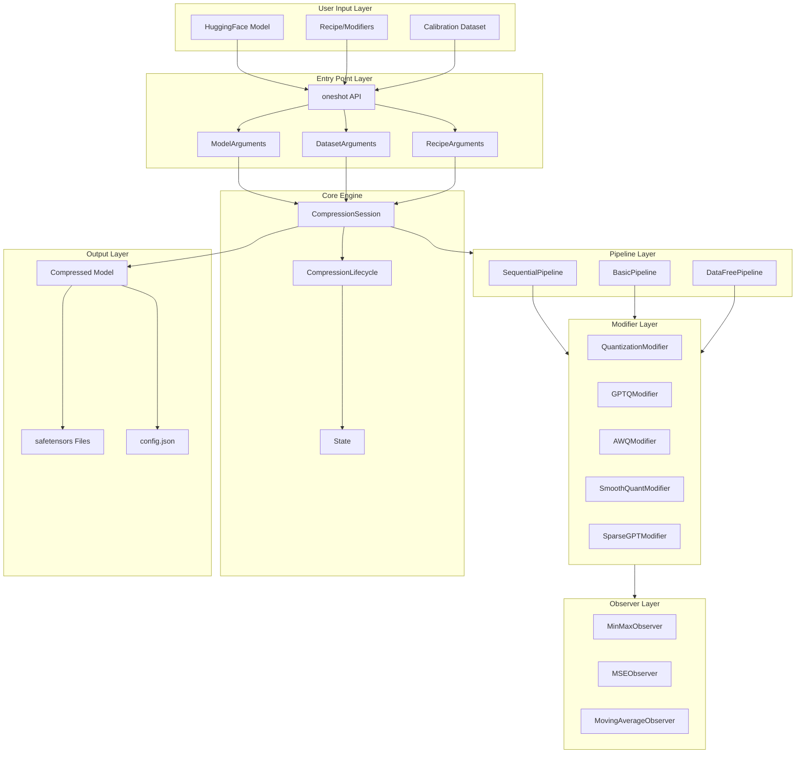
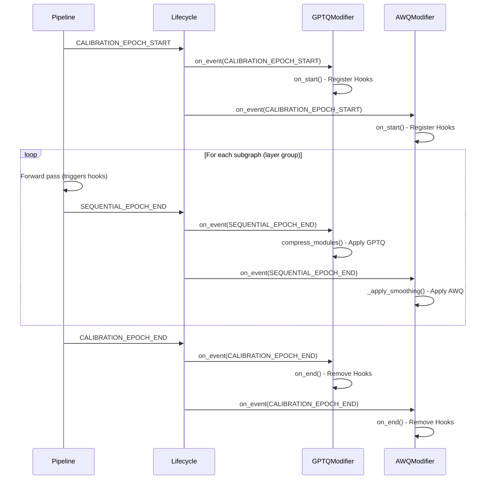

# LLM-Compressor Project Deep Dive Guide

## Project Metadata

| Item | Value |
|------|-------|
| **Latest Commit** | `6cf8d29ca0cc790f92a6e2c3794d42aab3c396ff` |
| **Short Hash** | `6cf8d29c` |
| **Commit Message** | `[Bugfix] Disable lm_head output device movement for multigpu dispatch (#2108)` |
| **Author** | Kyle Sayers |
| **Date** | Wed Dec 10 19:14:08 2025 -0500 |
| **Latest Tag** | `0.8.1` |
| **Recent Tags** | `0.8.1`, `0.8.0`, `0.7.1`, `0.7.0`, `0.6.0.1` |
| **Maintainer** | Red Hat AI & vLLM Project |
| **License** | Apache 2.0 |
| **Repository** | https://github.com/vllm-project/llm-compressor |

---

# Part 1: Project Background & Motivation (项目背景与动机)

## 1.1 The Fundamental Problem: Memory Wall

在深入代码之前，我们必须理解 **为什么** 需要模型压缩。

### 1.1.1 GPU 内存带宽 vs 计算能力

| GPU | Memory Bandwidth | Compute (FP16) | Ratio |
|-----|------------------|----------------|-------|
| A100 80GB | 2 TB/s | 312 TFLOPS | 6.4 FLOPS/byte |
| H100 80GB | 3.35 TB/s | 990 TFLOPS | 3.4 FLOPS/byte |
| RTX 4090 | 1 TB/s | 82 TFLOPS | 82 FLOPS/byte |

**关键洞见**: 现代 GPU 的计算能力增长速度远超内存带宽。对于 LLM 推理（特别是自回归生成），大部分时间花在从 HBM (High Bandwidth Memory) 加载权重上，而不是实际的矩阵乘法。

### 1.1.2 LLM 推理的内存需求

以 Llama-3 70B 为例：

| Precision | Size per Parameter | Total Model Size | Required VRAM |
|-----------|-------------------|------------------|---------------|
| FP32 | 4 bytes | 280 GB | > 280 GB |
| FP16/BF16 | 2 bytes | 140 GB | ~ 140 GB |
| INT8 | 1 byte | 70 GB | ~ 70 GB |
| INT4 | 0.5 bytes | 35 GB | ~ 35 GB |

**结论**: 
- FP16 的 70B 模型无法在单张 A100 80GB 上运行
- INT4 量化后可以在单张 RTX 4090 24GB 上勉强运行（需要 offloading）
- 更小的模型 = 更快的推理速度（减少内存传输时间）

### 1.1.3 Roofline Model 分析

```
Throughput = min(Compute_Bound, Memory_Bound)

For LLM Inference (batch_size=1):
- Compute: O(d_model^2) FLOPs per layer
- Memory: O(d_model^2) bytes to load per layer
- Arithmetic Intensity = FLOPs / Bytes ≈ 1 (very low!)

结论: LLM 推理是典型的 Memory Bound 任务
```

## 1.2 The Solution: Model Compression

模型压缩包含两大技术路线：

### 1.2.1 Quantization (量化)
将高精度数值（FP32/FP16）映射到低精度数值（INT8/INT4/FP8/FP4）。

### 1.2.2 Sparsification (稀疏化)
将部分权重设为零，减少存储和计算量。

**`llm-compressor` 同时支持这两种技术**，并提供了多种算法实现。

---

# Part 2: Technical Background (背景技术详解)

## 2.1 Quantization Theory (量化理论)

### 2.1.1 Basic Quantization Formula

**Uniform Affine Quantization (均匀仿射量化)**:

```
量化 (Quantize):
    q = clamp(round(x / s) + z, q_min, q_max)

反量化 (Dequantize):
    x_hat = s * (q - z)

其中:
    x     = 原始浮点数 (e.g., FP16)
    s     = Scale (缩放因子)
    z     = Zero-Point (零点偏移)
    q     = 量化后的整数 (e.g., INT8)
    q_min = 量化范围下界 (e.g., -128 for INT8)
    q_max = 量化范围上界 (e.g., 127 for INT8)
```

### 2.1.2 Scale and Zero-Point Calculation

给定一组待量化的数值，如何确定最优的 `scale` 和 `zero_point`？

**MinMax 方法 (最常用)**:

```python
# from llmcompressor/observers/min_max.py (simplified)
def calculate_qparams(min_val, max_val, num_bits, symmetric):
    if symmetric:
        # symmetric: zero_point = 0
        q_max = 2 ** (num_bits - 1) - 1
        q_min = -q_max
        max_abs = max(abs(min_val), abs(max_val))
        scale = max_abs / q_max
        zero_point = 0
    else:
        # asymmetric: zero_point != 0
        q_max = 2 ** num_bits - 1
        q_min = 0
        scale = (max_val - min_val) / (q_max - q_min)
        zero_point = round(-min_val / scale)
    
    return scale, zero_point
```

### 2.1.3 Quantization Granularity (量化粒度)

| Granularity | Description | Scale Count | Accuracy | Overhead |
|-------------|-------------|-------------|----------|----------|
| **Per-Tensor** | 整个张量共享一个 scale | 1 | Low | Lowest |
| **Per-Channel** | 每个输出通道一个 scale | `out_features` | Medium | Low |
| **Per-Group** | 每 `group_size` 个元素一个 scale | `total / group_size` | High | Medium |
| **Per-Token** (Activation) | 每个 token 一个 scale | Dynamic | Highest | Highest |

**实际应用**:
- 权重量化: Per-Channel 或 Per-Group (group_size=128 是常用值)
- 激活值量化: Per-Token (Dynamic) 或 Per-Tensor (Static)

### 2.1.4 Symmetric vs. Asymmetric

```
Symmetric Quantization:
    - zero_point = 0
    - 假设数据分布以 0 为中心
    - 公式简化: q = round(x / s), x_hat = s * q
    - 优点: 计算更快，矩阵乘法可以融合
    - 缺点: 对非对称分布 (如 ReLU 后的激活) 效率低

Asymmetric Quantization:
    - zero_point != 0
    - 可以处理任意分布
    - 公式: q = round(x / s) + z, x_hat = s * (q - z)
    - 优点: 更好地利用量化范围
    - 缺点: 需要额外存储 zero_point，计算稍慢
```

## 2.2 Post-Training Quantization (PTQ) 详解

### 2.2.1 PTQ vs. QAT

| 特性 | Post-Training Quantization (PTQ) | Quantization-Aware Training (QAT) |
|------|----------------------------------|-----------------------------------|
| 训练需求 | 不需要训练，只需校准数据 | 需要完整训练流程 |
| 数据需求 | 少量校准数据 (100-1000 samples) | 完整训练数据集 |
| 时间成本 | 分钟到小时 | 天到周 |
| 精度恢复 | 对低比特 (INT4) 有挑战 | 最好 |
| 适用场景 | 生产部署、快速迭代 | 追求极致精度 |

**`llm-compressor` 主要关注 PTQ**，因为：
1. LLM 的训练成本极高，重新训练不现实
2. 大多数场景下 PTQ 已经足够好
3. 部署速度要求快

### 2.2.2 Calibration (校准) 的作用

校准是 PTQ 的核心步骤。其目的是：

1. **确定 Activation 的分布范围**: 权重是静态的，但激活值依赖输入
2. **收集统计信息**: MinMax, MSE, KL Divergence 等
3. **为算法提供输入**: GPTQ 需要 Hessian，AWQ 需要 Activation 均值

**校准流程**:
```python
# pseudo-code
for batch in calibration_dataloader:
    # 1. forward pass through model
    outputs = model(batch)
    
    # 2. observers collect statistics
    for layer in model.layers:
        layer.observer.update(layer.input, layer.output)

# 3. calculate quantization parameters
for layer in model.layers:
    scale, zero_point = layer.observer.get_qparams()
```

## 2.3 Core Algorithms Deep Dive

### 2.3.1 GPTQ (Generative Pre-trained Transformer Quantization)

**论文**: [arXiv:2210.17323](https://arxiv.org/abs/2210.17323)

**核心思想**: 利用二阶信息 (Hessian) 进行智能量化，将量化误差从敏感权重转移到不敏感权重。

**数学推导**:

```
目标: 最小化量化后的输出误差
    min_Q || W*X - Q*X ||^2

其中:
    W = 原始权重矩阵
    Q = 量化后的权重矩阵
    X = 校准数据的激活值

使用 Taylor 展开近似:
    L(Q) ≈ L(W) + (Q-W)^T * g + 0.5 * (Q-W)^T * H * (Q-W)

其中 H 是 Hessian 矩阵:
    H = ∂²L / ∂W² ≈ 2 * X * X^T
```

**GPTQ 的关键优化**:

1. **Lazy Batch Updates**: 将多列的误差累积后再更新
2. **Cholesky Decomposition**: 高效求解 Hessian 逆
3. **Activation Ordering**: 按激活值大小排序，优先量化不重要的权重

**源码位置**: `src/llmcompressor/modifiers/quantization/gptq/gptq_quantize.py`

```python
# 核心算法 (简化版)
def quantize_weight(module, quant_args, hessians_dict, blocksize, percdamp):
    W = module.weight.clone()
    H = hessians_dict[module]
    
    # Step 1: Cholesky decomposition for numerical stability
    damp = percdamp * torch.mean(torch.diag(H))
    H[diag, diag] += damp
    H = torch.linalg.cholesky(H)
    Hinv = torch.cholesky_inverse(H)
    Hinv = torch.linalg.cholesky(Hinv, upper=True)
    
    # Step 2: Iterate through columns in blocks
    for i1 in range(0, num_columns, blocksize):
        i2 = min(i1 + blocksize, num_columns)
        
        W1 = W[:, i1:i2].clone()
        Q1 = torch.zeros_like(W1)
        Err1 = torch.zeros_like(W1)
        Hinv1 = Hinv[i1:i2, i1:i2]
        
        for i in range(i2 - i1):
            w = W1[:, i]
            d = Hinv1[i, i]
            
            # Quantize current column
            q = fake_quantize(w, scale, zero_point, quant_args)
            Q1[:, i] = q
            
            # Compute and propagate error
            err = (w - q) / d
            W1[:, i:] -= err.unsqueeze(1) @ Hinv1[i, i:].unsqueeze(0)
            Err1[:, i] = err
        
        # Apply block update
        W[:, i1:i2] = Q1
        W[:, i2:] -= Err1 @ Hinv[i1:i2, i2:]
    
    return W, scale, zero_point
```

### 2.3.2 AWQ (Activation-Weighted Quantization)

**论文**: [arXiv:2306.00978](https://arxiv.org/abs/2306.00978)

**核心思想**: 通过观测激活值，找到 "salient channels"（显著通道），并通过缩放保护这些通道。

**数学原理**:

```
AWQ 的损失函数:
    L(s) = || Q(W * s) * (s^{-1} * X) - W * X ||

其中:
    s = per-channel scaling factor
    Q() = quantization function
    W = weight matrix
    X = activation matrix

优化目标: 找到最优的 s 使得 L(s) 最小
方法: Grid Search over ratio α ∈ [0, 1]
    s = x_mean^α / w_mean^(1-α)
```

**源码位置**: `src/llmcompressor/modifiers/awq/base.py`

```python
# 核心算法 (简化版)
def _compute_best_scale(self, x_mean, w_mean, parent_module, linears, fp16_outputs):
    best_scales = None
    best_error = float("inf")
    
    for ratio in [i / self.n_grid for i in range(self.n_grid)]:
        # Compute scales
        if self.duo_scaling:
            scales = (x_mean.pow(ratio) / (w_mean.pow(1 - ratio) + 1e-4))
        else:
            scales = x_mean.pow(ratio)
        scales = scales / (scales.max() * scales.min()).sqrt()
        
        # Apply scaling and quantize
        for linear in linears:
            linear.weight.mul_(scales.view(1, -1))
            linear.weight.data = pseudo_quantize(linear.weight.data)
            linear.weight.div_(scales.view(1, -1))
        
        # Compute error
        int_w_outputs = self._run_samples(parent_module)
        loss = self._compute_loss(fp16_outputs, int_w_outputs)
        
        if loss < best_error:
            best_error = loss
            best_scales = scales.clone()
    
    return best_scales
```

### 2.3.3 SmoothQuant

**论文**: [arXiv:2211.10438](https://arxiv.org/abs/2211.10438)

**核心思想**: Activation 的分布往往比 Weight 更不均匀（存在 Outliers）。通过平滑因子，将 Activation 的"尖峰"转移到 Weight 上。

**数学原理**:

```
原始计算: Y = X * W

引入平滑因子 s:
    Y = (X * diag(s)^{-1}) * (diag(s) * W)
      = X_smooth * W_scaled

其中:
    s_j = max(|X_j|)^α / max(|W_j|)^(1-α)
    α = smoothing_strength ∈ [0, 1]

效果:
    - X_smooth 的动态范围减小，更容易量化
    - W_scaled 的动态范围增大，但 Weight 本来就好量化
```

**源码位置**: `src/llmcompressor/modifiers/smoothquant/base.py`

```python
# 核心算法
def _calculate_smoothing_scales(self, balance_layers, activation_scales):
    # Get weight scales
    weight_scales = []
    for layer in balance_layers:
        scale = layer.weight.abs().max(dim=0)[0]
        weight_scales.append(scale)
    weight_scales = 2.0 * torch.cat(weight_scales, dim=0).max(dim=0)[0]
    
    # Calculate smoothing scales
    # s_j = max(|X_j|)^α / max(|W_j|)^(1-α)
    scales = activation_scales.pow(self.smoothing_strength) / \
             weight_scales.pow(1 - self.smoothing_strength)
    
    return scales
```

---

# Part 3: Architecture & API Design (架构与接口设计详解)

## 3.1 High-Level Architecture



## 3.2 Core Components Deep Dive

### 3.2.1 `Oneshot` Class

**位置**: `src/llmcompressor/entrypoints/oneshot.py`

`Oneshot` 是整个压缩流程的协调者。它的职责是：

1. **解析参数**: 将用户输入转换为内部数据结构
2. **预处理**: 加载模型、Tokenizer、处理 Embedding 共享
3. **执行压缩**: 通过 Pipeline 和 Modifier 完成压缩
4. **后处理**: 保存模型和配置

```python
# Oneshot Lifecycle
class Oneshot:
    def __init__(self, **kwargs):
        # 1. Parse arguments
        model_args, dataset_args, recipe_args, output_dir = parse_args(**kwargs)
        
        # 2. Preprocessing
        pre_process(model_args, dataset_args, output_dir)
        
        # 3. Set instance attributes
        self.model = model_args.model
        self.processor = model_args.processor
        self.recipe = recipe_args.recipe
    
    def __call__(self):
        # 4. Get calibration dataloader
        dataloader = get_calibration_dataloader(self.dataset_args, self.processor)
        
        # 5. Apply recipe modifiers
        self.apply_recipe_modifiers(dataloader)
        
        # 6. Postprocessing
        post_process(self.model_args, self.recipe_args, self.output_dir)
```

### 3.2.2 `CompressionSession` & `CompressionLifecycle`

**位置**: `src/llmcompressor/core/session.py`, `src/llmcompressor/core/lifecycle.py`

Session 管理全局压缩状态，Lifecycle 负责调度 Modifier 的生命周期事件。

```python
# CompressionLifecycle Event Flow
@dataclass
class CompressionLifecycle:
    state: State
    recipe: Recipe
    
    def initialize(self, recipe, **kwargs):
        """初始化所有 Modifiers"""
        self.recipe = Recipe.create_instance(recipe)
        for mod in self.recipe.modifiers:
            mod.initialize(state=self.state, **kwargs)
    
    def event(self, event_type: EventType, **kwargs):
        """分发事件到所有 Modifiers"""
        event = Event(type_=event_type)
        for mod in self.recipe.modifiers:
            mod.update_event(state=self.state, event=event, **kwargs)
    
    def finalize(self, **kwargs):
        """完成所有 Modifiers"""
        for mod in self.recipe.modifiers:
            mod.finalize(state=self.state, **kwargs)
```

### 3.2.3 Event System

**位置**: `src/llmcompressor/core/events/event.py`

`llm-compressor` 使用事件驱动架构来解耦组件。

```python
class EventType(Enum):
    # Training Lifecycle
    INITIALIZE = "initialize"
    FINALIZE = "finalize"
    
    # Batch Lifecycle (for QAT)
    BATCH_START = "batch_start"
    LOSS_CALCULATED = "loss_calculated"
    BATCH_END = "batch_end"
    
    # Calibration Lifecycle (for PTQ)
    CALIBRATION_EPOCH_START = "calibration_epoch_start"
    SEQUENTIAL_EPOCH_END = "sequential_epoch_end"  # 逐层处理完成
    CALIBRATION_EPOCH_END = "calibration_epoch_end"
    
    # Optimizer Lifecycle
    OPTIM_PRE_STEP = "optim_pre_step"
    OPTIM_POST_STEP = "optim_post_step"
```

**事件流 (PTQ Sequential Pipeline)**:



### 3.2.4 Modifier Base Class

**位置**: `src/llmcompressor/modifiers/modifier.py`

所有 Modifier 都继承自这个基类，实现标准的生命周期接口。

```python
class Modifier(ModifierInterface, HooksMixin):
    """
    Modifier 生命周期:
    1. initialize() -> on_initialize()
    2. update_event() -> on_event() -> on_start() / on_end()
    3. finalize() -> on_finalize()
    """
    
    # 状态标志
    initialized_: bool = False
    finalized_: bool = False
    started_: bool = False
    ended_: bool = False
    
    @abstractmethod
    def on_initialize(self, state: State, **kwargs) -> bool:
        """初始化 Modifier，必须由子类实现"""
        raise NotImplementedError()
    
    def on_start(self, state: State, event: Event, **kwargs):
        """Modifier 开始时调用（可选）"""
        pass
    
    def on_event(self, state: State, event: Event, **kwargs):
        """处理事件（可选）"""
        pass
    
    def on_end(self, state: State, event: Event, **kwargs):
        """Modifier 结束时调用（可选）"""
        pass
    
    def on_finalize(self, state: State, **kwargs) -> bool:
        """清理资源（可选）"""
        return True
```

### 3.2.5 Pipeline System

**位置**: `src/llmcompressor/pipelines/`

Pipeline 决定了校准数据如何流经模型。

| Pipeline | 适用场景 | 特点 |
|----------|----------|------|
| **SequentialPipeline** | GPTQ, AWQ, SparseGPT | 逐层处理，支持大模型，低内存 |
| **BasicPipeline** | 简单 PTQ | 完整 forward pass |
| **DataFreePipeline** | FP8 Dynamic | 无需校准数据 |

**SequentialPipeline 详解**:

```python
# src/llmcompressor/pipelines/sequential/pipeline.py
@CalibrationPipeline.register("sequential")
class SequentialPipeline(CalibrationPipeline):
    @staticmethod
    def __call__(model, dataloader, dataset_args):
        """
        Sequential Pipeline 工作流程:
        
        1. 将模型划分为多个 subgraph (通常按 Transformer Layer)
        2. 对每个 subgraph:
           a. 运行 forward pass 触发 hooks (收集统计)
           b. 触发 SEQUENTIAL_EPOCH_END 事件 (应用压缩)
           c. 再次 forward pass 获取压缩后的输出
           d. 缓存输出作为下一个 subgraph 的输入
        3. 触发 CALIBRATION_EPOCH_END 事件
        """
        
        # Trace model to get subgraphs
        subgraphs = trace_subgraphs(model, sample_input, sequential_targets)
        
        LifecycleCallbacks.calibration_epoch_start()
        
        # Prepare activation cache
        activations = IntermediatesCache.from_dataloader(dataloader)
        
        for subgraph in subgraphs:
            # Pass 1: Calibration (triggers modifier hooks)
            for batch_idx in range(len(dataloader)):
                inputs = activations.fetch(batch_idx, subgraph.input_names)
                subgraph.forward(model, **inputs)
            
            # Apply compression
            LifecycleCallbacks.sequential_epoch_end(subgraph)
            
            # Pass 2: Propagation (capture compressed outputs)
            with HooksMixin.disable_hooks():
                for batch_idx in range(len(dataloader)):
                    inputs = activations.fetch(batch_idx, subgraph.input_names)
                    output = subgraph.forward(model, **inputs)
                    activations.update(batch_idx, output)
        
        LifecycleCallbacks.calibration_epoch_end()
```

### 3.2.6 Observer System

**位置**: `src/llmcompressor/observers/`

Observer 负责收集统计信息并计算量化参数。

```python
# Observer 类型
class Observer(InternalModule, RegistryMixin):
    """
    Observer 接口:
    - get_min_max(observed) -> (min, max)
    - get_global_min_max(observed) -> (min, max)
    - forward(observed) -> (scale, zero_point)
    - get_global_scale(observed) -> global_scale
    """

# 具体实现
@Observer.register("memoryless_minmax")
class MemorylessMinMaxObserver(Observer):
    """每次只看当前 batch 的 min/max"""

@Observer.register("static_minmax")
class StaticMinMaxObserver(Observer):
    """记住所有 batch 的全局 min/max"""

@Observer.register("minmax")
class MinMaxObserver(MovingAverageObserverBase):
    """使用移动平均计算 min/max"""
```

---

# Part 4: Supported Compression Schemes (支持的压缩方案)

## 4.1 Quantization Schemes

| Scheme | Weights | Activations | Algorithm | Calibration | Hardware |
|--------|---------|-------------|-----------|-------------|----------|
| **W8A8-FP8** | FP8 (Channel-wise) | FP8 (Dynamic Per-Token) | Simple PTQ | No | Hopper+ |
| **W8A8-INT8** | INT8 (Channel-wise, GPTQ) | INT8 (Dynamic Per-Token) | GPTQ + SmoothQuant | Yes | All |
| **W4A16** | INT4 (Group-wise, GPTQ/AWQ) | FP16 | GPTQ or AWQ | Yes | All |
| **W8A16** | INT8 (Channel-wise) | FP16 | Simple PTQ | Yes | All |
| **NVFP4** | FP4 (Microscaling) | FP4 (Microscaling) | NVFP4 specific | Yes | Blackwell+ |
| **W8A8-FP8_BLOCK** | FP8 (Block-wise 128x128) | FP8 (Dynamic Per-Token-Group 128) | DeepSeek V3 style | No | Hopper+ |

## 4.2 Sparsification Schemes

| Scheme | Pattern | Algorithm | Calibration | Hardware |
|--------|---------|-----------|-------------|----------|
| **2:4 Semi-structured** | 每 4 个权重中有 2 个为 0 | SparseGPT | Yes | Hopper+ (Sparse Tensor Cores) |
| **Unstructured** | 任意位置为 0 | Magnitude Pruning | No | All |

## 4.3 Combination Schemes

| Scheme | Components | Use Case |
|--------|------------|----------|
| **2:4 Sparse + FP8** | 2:4 Sparsity + FP8 Quantization | 最高压缩率 with Hopper |
| **2:4 Sparse + W4A16** | 2:4 Sparsity + INT4 Weights | 高压缩率 on older GPUs |

---

# Part 5: Project Structure (项目结构详解)

```
llm-compressor/
├── src/llmcompressor/
│   │
│   ├── entrypoints/              # 入口点
│   │   ├── oneshot.py            # oneshot() 函数和 Oneshot 类
│   │   ├── model_free/           # 无需模型的压缩 (data-free)
│   │   │   ├── helpers.py
│   │   │   ├── lifecycle.py
│   │   │   └── process.py
│   │   └── utils.py              # 预处理/后处理工具
│   │
│   ├── core/                     # 核心引擎
│   │   ├── session.py            # CompressionSession
│   │   ├── lifecycle.py          # CompressionLifecycle
│   │   ├── state.py              # State 数据类
│   │   └── events/               # 事件系统
│   │       └── event.py          # Event, EventType
│   │
│   ├── modifiers/                # Modifier 实现
│   │   ├── modifier.py           # Modifier 基类
│   │   ├── interface.py          # ModifierInterface
│   │   ├── factory.py            # Modifier 工厂
│   │   │
│   │   ├── quantization/         # 量化相关
│   │   │   ├── quantization/     # QuantizationModifier
│   │   │   │   ├── base.py
│   │   │   │   └── mixin.py      # QuantizationMixin
│   │   │   ├── gptq/             # GPTQModifier
│   │   │   │   ├── base.py
│   │   │   │   └── gptq_quantize.py  # GPTQ 核心算法
│   │   │   └── calibration.py    # 校准工具
│   │   │
│   │   ├── awq/                  # AWQModifier
│   │   │   ├── base.py
│   │   │   └── mappings.py       # Layer Mappings
│   │   │
│   │   ├── smoothquant/          # SmoothQuantModifier
│   │   │   ├── base.py
│   │   │   └── utils.py
│   │   │
│   │   ├── autoround/            # AutoRoundModifier
│   │   │   └── base.py
│   │   │
│   │   ├── pruning/              # 稀疏化相关
│   │   │   ├── sparsegpt/        # SparseGPTModifier
│   │   │   ├── wanda/            # WandaModifier
│   │   │   ├── magnitude/        # MagnitudePruningModifier
│   │   │   └── constant/         # ConstantPruningModifier
│   │   │
│   │   ├── transform/            # 变换相关
│   │   │   ├── quip/             # QuIPModifier (Hadamard)
│   │   │   └── spinquant/        # SpinQuantModifier
│   │   │
│   │   └── utils/                # Modifier 工具
│   │       ├── hooks.py          # HooksMixin
│   │       └── helpers.py
│   │
│   ├── pipelines/                # 校准流水线
│   │   ├── registry.py           # CalibrationPipeline 基类
│   │   ├── sequential/           # SequentialPipeline (逐层)
│   │   │   ├── pipeline.py
│   │   │   ├── helpers.py
│   │   │   └── ast_helpers.py    # 图追踪工具
│   │   ├── basic/                # BasicPipeline (完整 forward)
│   │   │   └── pipeline.py
│   │   ├── data_free/            # DataFreePipeline (无校准)
│   │   │   └── pipeline.py
│   │   └── cache.py              # IntermediatesCache
│   │
│   ├── observers/                # 观测器
│   │   ├── base.py               # Observer 基类
│   │   ├── min_max.py            # MinMaxObserver
│   │   ├── mse.py                # MSEObserver
│   │   └── helpers.py
│   │
│   ├── recipe/                   # Recipe 解析
│   │   ├── recipe.py             # Recipe 类
│   │   └── utils.py
│   │
│   ├── transformers/             # Transformers 集成
│   │   ├── compression/          # 压缩保存工具
│   │   ├── data/                 # 内置校准数据集
│   │   │   ├── c4.py
│   │   │   ├── wikitext.py
│   │   │   ├── open_platypus.py
│   │   │   └── ...
│   │   └── utils/
│   │
│   ├── modeling/                 # 特定模型支持
│   │   ├── llama4.py
│   │   ├── deepseek_v3.py
│   │   ├── qwen3_moe.py
│   │   └── ...
│   │
│   ├── args/                     # 参数解析
│   │   ├── model_arguments.py
│   │   ├── dataset_arguments.py
│   │   └── recipe_arguments.py
│   │
│   └── utils/                    # 通用工具
│       ├── helpers.py
│       ├── fsdp/                 # FSDP 支持
│       └── pytorch/
│
├── examples/                     # 示例代码
│   ├── quantization_w8a8_fp8/    # FP8 量化示例
│   ├── quantization_w8a8_int8/   # INT8 量化示例
│   ├── quantization_w4a16/       # INT4 (GPTQ) 示例
│   ├── awq/                      # AWQ 示例
│   ├── multimodal_vision/        # 多模态模型示例
│   ├── quantizing_moe/           # MoE 模型示例
│   └── ...
│
├── tests/                        # 测试
│   ├── llmcompressor/            # 单元测试
│   ├── e2e/                      # 端到端测试
│   └── ...
│
└── docs/                         # 文档
    ├── guides/
    │   ├── compression_schemes.md
    │   └── saving_a_model.md
    └── ...
```

---

# Part 6: Practical Examples (实战示例详解)

## 6.1 Example 1: FP8 Dynamic Quantization (最简单)

```python
"""
FP8 Dynamic 量化是最简单的开始点:
- 不需要校准数据 (Data-Free)
- 权重和激活都量化到 FP8
- 适合 Hopper (H100) 及以上 GPU
"""
from transformers import AutoModelForCausalLM, AutoTokenizer
from llmcompressor import oneshot
from llmcompressor.modifiers.quantization import QuantizationModifier

# 1. Load model
model_id = "meta-llama/Meta-Llama-3-8B-Instruct"
model = AutoModelForCausalLM.from_pretrained(model_id, torch_dtype="auto")
tokenizer = AutoTokenizer.from_pretrained(model_id)

# 2. Define recipe
# FP8_DYNAMIC: weights are static FP8, activations are dynamic FP8 per-token
recipe = QuantizationModifier(
    targets="Linear",          # 量化所有 Linear 层
    scheme="FP8_DYNAMIC",      # 使用 FP8 动态量化方案
    ignore=["lm_head"]         # 忽略 lm_head 以保持精度
)

# 3. Apply quantization (no calibration data needed!)
oneshot(model=model, recipe=recipe)

# 4. Save
model.save_pretrained("Llama-3-8B-FP8-Dynamic")
tokenizer.save_pretrained("Llama-3-8B-FP8-Dynamic")
```

## 6.2 Example 2: INT4 GPTQ Quantization (高压缩率)

```python
"""
GPTQ INT4 量化提供最高压缩率:
- 需要校准数据
- 权重量化到 INT4 (group_size=128)
- 激活保持 FP16
- 适合所有 GPU
"""
from datasets import load_dataset
from transformers import AutoModelForCausalLM, AutoTokenizer
from llmcompressor import oneshot
from llmcompressor.modifiers.quantization import GPTQModifier

# 1. Load model
model_id = "meta-llama/Meta-Llama-3-8B-Instruct"
model = AutoModelForCausalLM.from_pretrained(model_id, torch_dtype="auto")
tokenizer = AutoTokenizer.from_pretrained(model_id)

# 2. Prepare calibration dataset
NUM_CALIBRATION_SAMPLES = 512
MAX_SEQUENCE_LENGTH = 2048

ds = load_dataset("HuggingFaceH4/ultrachat_200k", split="train_sft")
ds = ds.shuffle(seed=42).select(range(NUM_CALIBRATION_SAMPLES))

def preprocess(example):
    return {
        "text": tokenizer.apply_chat_template(
            example["messages"],
            tokenize=False,
        )
    }

ds = ds.map(preprocess)

def tokenize(sample):
    return tokenizer(
        sample["text"],
        padding=False,
        max_length=MAX_SEQUENCE_LENGTH,
        truncation=True,
        add_special_tokens=False,
    )

ds = ds.map(tokenize, remove_columns=ds.column_names)

# 3. Define recipe
# W4A16: 4-bit weights with group_size=128, 16-bit activations
recipe = GPTQModifier(
    targets="Linear",
    scheme="W4A16",            # 4-bit weights, 16-bit activations
    ignore=["lm_head"],
    # GPTQ specific parameters
    block_size=128,            # columns to process at once
    dampening_frac=0.01,       # hessian damping
    actorder="static",         # activation ordering strategy
)

# 4. Apply quantization
oneshot(
    model=model,
    dataset=ds,
    recipe=recipe,
    max_seq_length=MAX_SEQUENCE_LENGTH,
    num_calibration_samples=NUM_CALIBRATION_SAMPLES,
)

# 5. Save
model.save_pretrained("Llama-3-8B-W4A16-GPTQ", save_compressed=True)
tokenizer.save_pretrained("Llama-3-8B-W4A16-GPTQ")
```

## 6.3 Example 3: SmoothQuant + GPTQ Combo (最高精度)

```python
"""
SmoothQuant + GPTQ 组合提供最佳精度:
- SmoothQuant 平滑激活分布
- GPTQ 智能量化权重
- 适合对精度敏感的场景
"""
from llmcompressor import oneshot
from llmcompressor.modifiers.smoothquant import SmoothQuantModifier
from llmcompressor.modifiers.quantization import GPTQModifier

# Recipe: apply SmoothQuant first, then GPTQ
recipe = [
    # Step 1: Smooth activations
    SmoothQuantModifier(
        smoothing_strength=0.8,  # α in [0, 1], higher = more smoothing
    ),
    # Step 2: Apply GPTQ
    GPTQModifier(
        scheme="W8A8",           # 8-bit weights and activations
        targets="Linear",
        ignore=["lm_head"],
    ),
]

# Apply
oneshot(
    model=model,
    dataset="open_platypus",   # built-in calibration dataset
    recipe=recipe,
    num_calibration_samples=512,
    max_seq_length=2048,
)
```

## 6.4 Example 4: AWQ Quantization (Activation-Aware)

```python
"""
AWQ 通过保护 salient channels 实现高精度 INT4:
- 自动推断 layer mappings
- 使用 grid search 找最优 scales
"""
from llmcompressor import oneshot
from llmcompressor.modifiers.awq import AWQModifier

recipe = AWQModifier(
    targets="Linear",
    scheme="W4A16",
    ignore=["lm_head"],
    # AWQ specific parameters
    n_grid=20,                 # grid search points
    duo_scaling=True,          # use both activation and weight for scaling
)

oneshot(
    model=model,
    dataset="open_platypus",
    recipe=recipe,
    num_calibration_samples=512,
    max_seq_length=2048,
)
```

## 6.5 Example 5: Mixed Precision (非均匀量化)

```python
"""
混合精度量化: 对不同层使用不同精度
- MLP 层使用 INT4 (压缩率高)
- Attention 层使用 INT8 (保持精度)
"""
from llmcompressor import oneshot
from llmcompressor.modifiers.quantization import GPTQModifier

# Recipe with multiple modifiers targeting different layers
recipe = [
    # INT4 for MLP layers
    GPTQModifier(
        targets=[
            "model.layers.\\d+.mlp.gate_proj",
            "model.layers.\\d+.mlp.up_proj",
            "model.layers.\\d+.mlp.down_proj",
        ],
        scheme="W4A16",
        ignore=["lm_head"],
    ),
    # INT8 for Attention layers
    GPTQModifier(
        targets=[
            "model.layers.\\d+.self_attn.q_proj",
            "model.layers.\\d+.self_attn.k_proj",
            "model.layers.\\d+.self_attn.v_proj",
            "model.layers.\\d+.self_attn.o_proj",
        ],
        scheme="W8A16",
        ignore=["lm_head"],
    ),
]

oneshot(
    model=model,
    dataset="open_platypus",
    recipe=recipe,
    num_calibration_samples=512,
)
```

---

# Part 7: Troubleshooting & Best Practices (故障排除与最佳实践)

## 7.1 Common Issues

### Issue 1: CUDA Out of Memory

**症状**: `RuntimeError: CUDA out of memory`

**解决方案**:
```python
# Option 1: Use sequential pipeline (default for GPTQ/AWQ)
# This processes layers one at a time

# Option 2: Reduce calibration samples
oneshot(..., num_calibration_samples=256)  # reduce from 512

# Option 3: Use CPU offloading
model = AutoModelForCausalLM.from_pretrained(
    model_id,
    device_map="auto",  # automatic device mapping with offloading
    torch_dtype=torch.float16,
)

# Option 4: For GPTQ, offload Hessians
recipe = GPTQModifier(
    ...,
    offload_hessians=True,  # offload Hessian matrices to CPU
)
```

### Issue 2: NaN or Inf in Outputs

**症状**: 量化后模型输出 NaN 或 Inf

**解决方案**:
```python
# Option 1: Increase dampening for GPTQ
recipe = GPTQModifier(
    ...,
    dampening_frac=0.1,  # increase from default 0.01
)

# Option 2: Check calibration data quality
# ensure no NaN/Inf in calibration data

# Option 3: Use more calibration samples
oneshot(..., num_calibration_samples=1024)
```

### Issue 3: Poor Accuracy After Quantization

**症状**: Perplexity 显著上升，输出质量下降

**解决方案**:
```python
# Option 1: Use SmoothQuant before quantization
recipe = [
    SmoothQuantModifier(smoothing_strength=0.8),
    GPTQModifier(...),
]

# Option 2: Use larger group_size
# (trades compression for accuracy)

# Option 3: Use AWQ instead of GPTQ
# AWQ often works better for some models

# Option 4: Keep sensitive layers in higher precision
recipe = GPTQModifier(
    ...,
    ignore=["lm_head", "model.layers.0", "model.layers.31"],  # first and last layers
)
```

## 7.2 Best Practices

### Practice 1: Always Ignore `lm_head`
```python
# lm_head is the output layer and very sensitive to quantization
recipe = GPTQModifier(..., ignore=["lm_head"])
```

### Practice 2: Use Appropriate Calibration Data
```python
# Use data that matches your deployment scenario
# For chat models, use chat data:
ds = load_dataset("HuggingFaceH4/ultrachat_200k", split="train_sft")

# For code models, use code data:
ds = load_dataset("codeparrot/github-code", split="train")
```

### Practice 3: Validate After Quantization
```python
# Always generate some samples to verify quality
from llmcompressor.utils import dispatch_for_generation

dispatch_for_generation(model)
output = model.generate(
    tokenizer("Hello, my name is", return_tensors="pt").input_ids.to(model.device),
    max_new_tokens=50
)
print(tokenizer.decode(output[0]))
```

### Practice 4: Use Perplexity for Evaluation
```python
# Compare perplexity before and after quantization
from lm_eval import evaluator
results = evaluator.simple_evaluate(
    model="hf",
    model_args=f"pretrained={save_dir}",
    tasks=["wikitext"],
)
print(f"Perplexity: {results['results']['wikitext']['perplexity']}")
```

---

# Summary

通过这份详细指南，你应该已经掌握了：

1. **理论基础**: 量化的数学原理、PTQ vs QAT、各种算法的核心思想
2. **架构设计**: Oneshot → Session → Lifecycle → Pipeline → Modifier → Observer 的完整链路
3. **源码剖析**: GPTQ、AWQ、SmoothQuant 的具体实现
4. **实战技能**: 从简单 FP8 到复杂混合精度的各种场景
5. **最佳实践**: 常见问题的解决方案

**下一步**: 请继续阅读 `TUTORIAL_LECTURES.md` 获取更多理论深度，然后动手完成练习脚本！
